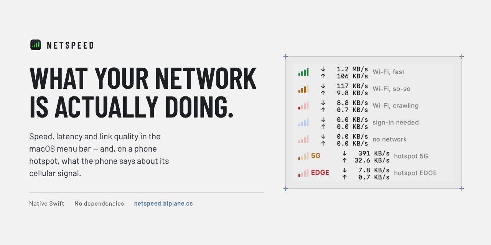

# NetSpeed



A network speed indicator for the macOS menu bar. Native Swift, no dependencies,
no permission prompts: a 0.9 MB universal binary, around 25 MB of memory and
well under 1% of a single core at idle.

The point is to see what the connection is doing without clicking anything —
especially on a phone hotspot, where the link keeps swinging.

<p align="center">
  
  
</p>

## Download

A ready disk image is on the
[releases page](https://github.com/sergeyerin/netspeed/releases), or at
[netspeed.biplane.cc](https://netspeed.biplane.cc/), which links to the same
file. macOS 13 or newer, on Apple silicon or Intel.

The app is signed ad-hoc rather than with a paid Apple developer certificate, so
the first launch is refused. Either allow it once in **System Settings → Privacy
& Security → Open Anyway**, or clear the download flag:

```bash
xattr -dr com.apple.quarantine /Applications/NetSpeed.app
```

## Build it yourself

```bash
./build.sh              # build into ./build/NetSpeed.app
./build.sh install      # build, install into ~/Applications and launch
tools/make-dmg.sh       # build and pack dist/NetSpeed-<version>.dmg
```

Only the Command Line Tools (`swiftc`) are needed. The app has no Dock icon
(`LSUIElement`) and no windows; enable startup from the menu, **Settings →
Launch at login**.

macOS asks for no permissions: the SSID comes from `ipconfig getsummary` rather
than CoreWLAN, which would require Location access.

A release is the image plus its checksum, attached to a tag:

```bash
gh release create v1.12 dist/NetSpeed-1.12.dmg dist/NetSpeed-1.12.dmg.sha256 \
    --title "NetSpeed 1.12" --notes "..."
```

The version comes from `CFBundleShortVersionString` in `Info.plist` — bump it
there and the image, the release and the app's own update check all follow.

## In the menu bar

On the left, the link indicator: a pair of chevron scales, down and up. On the
right, two monospaced lines — download and upload.

The arrows answer two questions at once, and it is worth knowing which is
which. **How far the lit part reaches** — five divisions per direction, each
direction on its own — is how much is crossing right now. **What colour it is**
is how well the link carries. They are independent, so a full amber stack is not
a contradiction: plenty of data moving over a mediocre connection is an ordinary
state, and so is a single green mark with nothing to send.

All five divisions are always drawn and the unreached ones are dimmed, the way
the scale on a tape deck stays visible while only the level lights up. A stack
that grew and shrank never showed how much room was left above it, and one mark
alone could not say whether it was the bottom of a ladder or the whole of it.

Nothing tells the two scales apart better than watching them disagree. A
strength meter cannot read five down and one up; traffic does it all the time.
The counts also repeat what the figures beside them already say, which is how
the scale gets learned without a legend — and the only reading left when the
numbers are switched off and the arrows stand alone.

The shape went through a correction. A four-bar scale came first: every
phone and Wi-Fi menu uses that one for signal strength, while this has always
meant how well the link carries — and on a hotspot the two disagree completely,
full bars to a phone getting nothing from the tower. Labelling a measured estimate `LTE` or `E`
was wrong the same way, making it look like a technology read off a modem, so
those letters are gone too. A label appears only when
there is a fact to state: the technology a tethering phone reports about itself
(`5G`, `LTE`, `EDGE`, …), shown with **Settings → Menu bar display → Arrows and
network type**, which also marks `OFF` for a dead network and `WEB` for a
captive portal.

| Colour | Menu says |
|---|---|
| green | **Good** (LTE/5G-like) |
| amber | **Fair** (weak 4G-like) |
| orange | **Slow** (3G-like) |
| red | **Awful** (EDGE-like) |
| crossed-out network, red | **Offline** |
| blue | **Sign-in needed** |

| Lit divisions | That direction is carrying |
|---|---|
| one | under 4 KB/s — idle, or background chatter |
| two | 4 KB/s to 32 KB/s |
| three | 32 KB/s to 256 KB/s |
| four | 256 KB/s to 2 MB/s |
| five | over 2 MB/s |

Five steps of eight times each, because that is the range this meets in
practice: a phone on EDGE tops out around the second division, a hotspot on LTE
lives in the middle, wired gigabit reaches the fifth. The bands are read from a
three-second peak, so a short burst stays visible long enough to be seen instead
of flickering past in one sample.

The menu leads with the verdict and puts the qualifier in brackets. On a hotspot
the brackets hold a fact instead of a comparison — `Awful (phone: 5G)` says the
phone claims 5G while the link crawls, which is the whole point of showing both.

Menu bar running out of room? **Settings → Menu bar display → Indicator only**
drops the numbers and leaves just the arrows — the item then takes about 20 points.
The same menu picks what the numbers show (download, combined, download with
latency) and the unit: bytes or bits.

See `preview/tray-light.png` and `preview/tray-dark.png`.

### The numbers hold their width

Two things make a naive readout jitter: the unit flipping between B/s and KB/s
every idle second, and the digit count changing with the value — the status item
resizes and shoves everything next to it sideways. Here the scale never drops
below kilo, steps up only past a full 1024 and back down only below 85% of it,
and the number is padded to a constant five characters in a fully monospaced
face. The result is always exactly ten characters: `  0.0 KB/s`, ` 14.6 KB/s`,
` 1023 KB/s`, ` 12.0 MB/s`. The indicator also reserves the width of its widest
label, so a change of state does not move the numbers either.

## In the menu

A header with the indicator, the verdict in one word with its qualifier, and the
current speed in large figures. Below it, two minutes of history — download up, upload down. Then
a table:

- peak over the last minute, session volume and uptime;
- **latency** to the internet and, separately, to the access point — current,
  average, jitter, loss;
- **hotspot phone** (when tethered): device name, cellular technology with the
  phone's own bars, and its battery level;
- **connection**: interface, SSID, the Wi-Fi signal scale with RSSI and SNR, link
  rate, channel with band and width, PHY mode, security, noise;
- **addresses**: IPv4, gateway, IPv6, active VPN, and the address the outside
  world sees with the country it resolves to — `185.x.x.x (🇱🇹 LT)`.

Both axes of the chart are labelled — the value its tallest point stands for and
how far back the left edge reaches — and hovering puts a cursor on it and reads
out that moment: direction, value, how long ago.

At the bottom: settings, "About NetSpeed" with the version and a "Check now" for
updates, "Copy summary" (all of the above as text, handy to send to support) and
quit. When a newer release exists, a row appears above them saying so and
opening the release page.

The data is drawn as custom views rather than assembled from menu items: macOS
paints disabled menu items grey no matter what color is set on them, and grey on
grey cannot be read. Notes wrap by word instead of being cut off with an ellipsis.

See `preview/menu-light.png` and `preview/menu-dark.png`.

## How it measures

**Traffic.** Byte counters come from a single `sysctl(NET_RT_IFLIST2)` — no
`netstat` process, no privileges. Checked against `netstat -ib`: within 2%, the
difference being the sampling moment.

**Which interface counts.** The physical link is the one to measure. With a VPN
up, the default route leads into a `utun`, but the bytes still travel over Wi-Fi
and the tunnel's traffic is already counted there — so auto-pick takes the first
non-tunnel interface holding a default route. Pin one manually in
**Settings → Interface**.

**Latency to the access point** — ICMP echo. On macOS a `SOCK_DGRAM` socket with
`IPPROTO_ICMP` opens without root, and routers — a phone in hotspot mode
included — answer pings. Where ICMP is filtered, three failures in a row switch
it to TCP handshake timing; a refused connection counts as an answer there, since
the RST arrives in the same time as a SYN/ACK, so no open port is needed.

**Latency to the internet** — a short HTTP request to a connectivity-check
endpoint (Cloudflare, Google or Apple). Not TCP to 1.1.1.1: with a VPN or a local
proxy in play, that handshake terminates on this very machine and reports a fake
1–3 ms instead of a real 100–600 ms. HTTP travels the whole path. The connection
is reused, so from the second measurement on it times a clean round trip. As a
bonus, any answer other than 204 means a captive portal.

If "the internet" ever answers faster than the gateway itself, the menu says so —
that is a local proxy talking, not the network.

**The external address.** One request to Cloudflare's `cdn-cgi/trace` returns
both the address and a country code, so a single round trip does what two lookup
services would. It runs only when the menu is opened, and only if the previous
answer is older than five minutes or the network changed — a switch almost
certainly means a new address. Behind a VPN or a proxy this reports the exit
node, which is usually the point of asking. Turn it off in
**Settings → Show external IP** and no such request is ever made.

**Staying current.** The verdict is judged on the last six probes — one minute —
rather than the whole ring. Over the full history a burst of failures would keep
the indicator red for minutes after the link had recovered. On top of that, the
app watches the interface, its address, the gateway and the SSID: joining another
network keeps the same `en0`, so without that check the previous network's
measurements would live on. When the identity changes, the latency history is
dropped, the pooled HTTP connection is flushed and a fresh probe fires at once.

## The hotspot phone's own readout

When an iPhone or iPad shares its connection, macOS shows its cellular bars,
battery and network type in the Wi-Fi menu. That data is kept in the dynamic
store under `State:/Network/Interface/<bsd>/AirPort`, in a `LastTetherDevice`
blob — a keyed archive of CoreWLAN's private `CWTetherDevice`. The archive is
ordinary NSCoding, so a stand-in class decodes it without calling private API,
and the numbers track the phone live.

That gives the app what no measurement can: the technology the phone is actually
on. It is the one label the menu bar will show, while the **colour still comes
from the measured latency**. So `5G` painted orange reads exactly as it should:
the phone claims 5G, the link behaves like weak 4G. The phone's own reception
sits in the menu, next to its battery, where there is room to say whose signal
it is.

The technology codes come from the enum ControlCenter uses for the same purpose
(`WiFiHotspotNetworkType`). Its cases are declared `other, _1x, GPRS, EDGE, _3G,
_4G, LTE, _5G`, and its jump table confirms 6 → LTE and 7 → 5G.

macOS keeps the last tethering device around after the phone disconnects, so the
data is only used while the Mac actually holds a hotspot address.

**Two different signal scales.** The menu shows both, and they mean opposite
things: `Cellular` is the phone's reception from the tower (what makes the link
fast or slow), while `Wi-Fi signal` is only the hop between the Mac and the phone
sitting next to it — usually excellent and telling you nothing about the
connection. Without a hotspot, only the Wi-Fi scale appears and the menu bar
label falls back to the measured estimate.

## Traffic the app itself uses

The internet latency probe is one HTTP request with an empty body every 10
seconds — roughly 1 KB per minute. Pinging the access point over ICMP costs no
mobile data at all. Both stop at **Settings → Latency → Measure latency**.

The update check asks GitHub for the latest release once a day, and the external
address is looked up only while the menu is open and only if the previous answer
is over five minutes old. Each has its own switch — **About NetSpeed → Check for
updates** and **Settings → Show external IP**.

## One copy at a time

Every running copy adds its own status item, and once the menu bar runs out of
room macOS silently drops the ones that no longer fit — so three copies show up
as no icon at all, which reads as a crash. That is how three of them accumulated
here: a build, one started straight from a disk image, and an installed one.

Starting a copy while an older one runs replaces it. Starting one while an equal
or newer copy runs leaves that one alone — it already holds two minutes of
history and the session totals, and swapping it for an identical build would
throw those away to put back what was there.

Launching NetSpeed when it is already running does not start a second process at
all: macOS sends the running copy a reopen event instead. That opens its menu,
which is both an answer and a way to find the icon. If the click goes nowhere the
icon did not fit in the menu bar, and a message says so and offers to quit —
otherwise an app with no icon, no window and no Dock presence cannot be quit at
all.

## Update checks

The app asks `api.github.com` for the latest release at launch and once a day
after that, and compares the tag with its own bundle version. The release is
already the one place the disk image lives, so it is also the one place worth
asking: a manifest on the site would be a second copy of the same fact, free to
disagree with the first.

It only reports. Downloading and replacing the app in place would need a
developer certificate to be safe, and without one Gatekeeper would refuse the
result anyway — so a newer version becomes a menu row pointing at the release
page.

## Layout

| File | Purpose |
|---|---|
| `Sources/Kernel.swift` | byte counters, default routes, addresses — via `sysctl`/`getifaddrs` |
| `Sources/Interfaces.swift` | interface classification, auto-pick, Wi-Fi readout |
| `Sources/Monitor.swift` | rates, history, session totals |
| `Sources/Latency.swift` | ICMP and HTTP probes, the overall verdict |
| `Sources/Hotspot.swift` | the tethering phone's cellular type, bars and battery |
| `Sources/ExternalIP.swift` | the address the outside world sees, with its country |
| `Sources/AppDelegate.swift` | status item and menu assembly |
| `Sources/Indicator.swift` | link indicator: arrows, label, colors for both themes |
| `Sources/MenuViews.swift` | header and the details table |
| `Sources/SparklineView.swift` | history chart |
| `Sources/Updates.swift` | version comparison and the release check |
| `Sources/AlreadyRunning.swift` | the window a redundant launch shows before leaving |
| `Sources/Format.swift` | constant-width rate formatter and value formatting |
| `Sources/Settings.swift` | preferences |
| `Resources/AppIcon.icns` | app icon, generated by `tools/make-icon.swift` |
| `tools/make-dmg.sh` | packs the built app into a disk image |
| `tools/make-icon.swift` | draws the app icon at every size and writes the .icns |
| `tools/make-banner.sh` | renders the banner above, from `tools/banner.html` |
